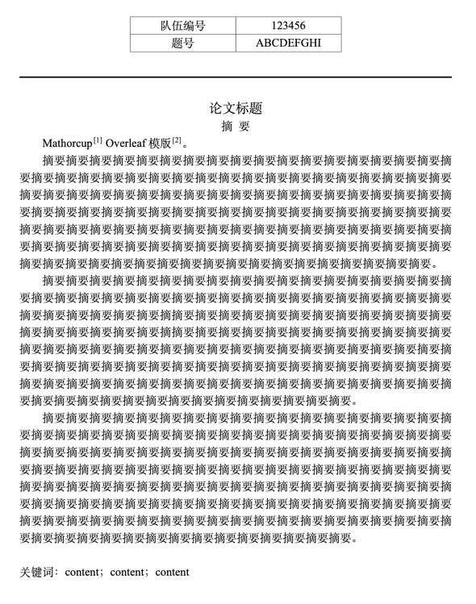
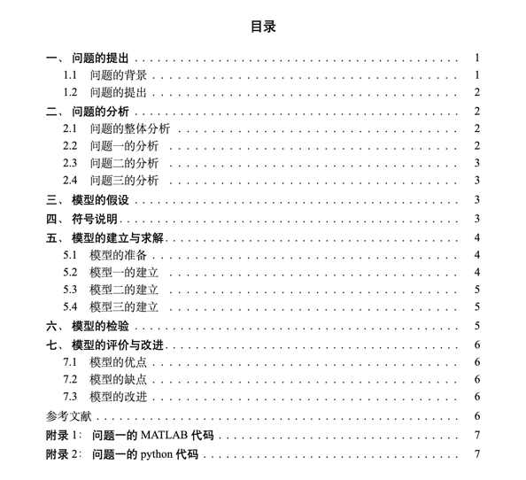
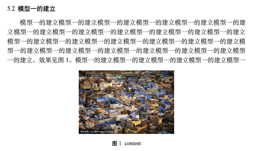
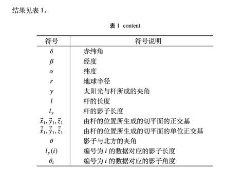
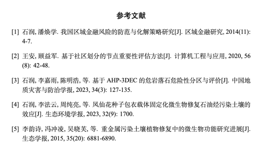
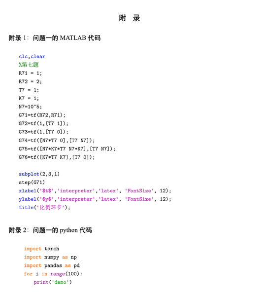

# MathorcupLatexTemplate

基于repo：[github sikouhjw repo](https://github.com/sikouhjw/MathorCupmodeling)

## how to use

将仓库中文件全部放入Overleaf中，按需求修改MMC.tex和ref.bib即可。

图片放在figure文件夹下。使用XeLaTeX编译

## 新增特性

在上述repo的基础上，修改了部分代码，实现了以下特性

- 修改了字体要求（注释掉MMCStyle.cls中line38），从而可用于Overleaf
- 添加``gbt7714-numerical.bst``文件，从而可使用gbt7714引用格式对bib文件进行引用文献管理

## 效果

